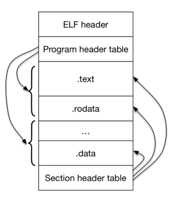

## lab1 report

## 在OSX 10.11中编译安装gcc

安装相关依赖
```
brew deps gcc
brew install gmp isl libmpc mpfr xz
```

编译安装gcc

```
brew fetch gcc
cd /Library/Caches/Homebrew
tar xvf gcc-5.3.0.el_capitan.tar.bz2
cd gcc-5.3.0
mkdir build              # GCC will not compile correctly unless you build in a separate directory
cd build
../configure --prefix=/usr/local  --target=i386-jos-elf --disable-werror  --disable-libssp --disable-libmudflap --with-newlib  --without-headers --enable-languages=c --with-gmp=/usr/local/Cellar/gmp/6.1.0 --with-mpfr=/usr/local/Cellar/mpfr/3.1.3/ --with-mpc=/usr/local/Cellar/libmpc/1.0.3
make all-gcc
make install-gcc
make all-target-libgcc
make install-target-libgcc
```

## 在OSX 10.11中编译安装gdb

```
brew fetch gdb
cd /Library/Caches/Homebrew
tar xvf gdb-7.8.3.tar.bz2
cd gdb-7.8.3
./configure --prefix=/usr/local --target=i386-jos-elf --program-prefix=i386-jos-elf- --disable-werror
make all
make install
```

## 在OSX 10.11中编译安装qemu

```
git clone https://github.com/geofft/qemu.git -b 6.828-1.7.0
./configure --disable-kvm --disable-sdl --target-list="i386-softmmu x86_64-softmmu"
make
make install
```
## Excercise 3

> At what point does the processor start executing 32-bit code? What exactly causes the switch from 16- to 32-bit mode?

从boot/boot.S中的第55行`ljmp $PROT_MODE_CSEG, $protcseg`后处理器开始执行32位指令代码。主要以下代码使处理器从16位模式转变成32位模式。将寄存器cr0中的最后一位设置成1，即代表开启了保护模式。

```
lgdt    gdtdesc
movl    %cr0, %eax
orl     $CR0_PE_ON, %eax
movl    %eax, %cr0
```

> What is the last instruction of the boot loader executed, and what is the first instruction of the kernel it just loaded?

boot loader最后执行的指令是`((void (*)(void)) (ELFHDR->e_entry));`,翻译成汇编后是`7d6b:ff 15 18 00 01 00    call   *0x10018`

kernel执行的第一条指令是`	movw	$0x1234,0x472			# warm boot`

> Where is the first instruction of the kernel?

一开始没有认真看`call *0x10018`这条汇编指令，以为是0x10018。这是错误的，*0x10018代表是0x10018处的地址，用gdb查看下可知是0x10000c。

```
(gdb) b *0x7d6b
Breakpoint 1 at 0x7d6b
(gdb) c
Continuing.
The target architecture is assumed to be i386
=> 0x7d6b:	call   *0x10018

Breakpoint 1, 0x00007d6b in ?? ()
(gdb) x/x 0x10018
0x10018:	0x0010000c
```

> How does the boot loader decide how many sectors it must read in order to fetch the entire kernel from disk? Where does it find this information?

ELF的格式可以用下图来描述:



ELF文件主要有ELF header 和file data两部分组成，file data包括以下三个部分：

* Program header table,可以描述一个或多个segment
* Section header table,可以描述0个或多个sections
* Data,programe header table 或者Section header table指向的数据

ELF文件格式提供了两种不同的视角，在汇编器和链接器看来，ELF文件是由Section Header Table描述的一系列Section的集合，而执行一个ELF文件时，在加载器（Loader）看来它是由Program Header Table描述的一系列Segment的集合,参考文献[ELF文件](http://docs.linuxtone.org/ebooks/C&CPP/c/ch18s05.html#ftn.id3014082)

```c
// load each program segment (ignores ph flags)
ph = (struct Proghdr *) ((uint8_t *) ELFHDR + ELFHDR->e_phoff);
eph = ph + ELFHDR->e_phnum;
for (; ph < eph; ph++)
	// p_pa is the load address of this segment (as well
	// as the physical address)
	readseg(ph->p_pa, ph->p_memsz, ph->p_offset);
```

## 参考
1. [Report for lab1, Shian Chen](https://github.com/Clann24/jos/tree/master/lab1)
2. [MIT 操作系统实验 MIT JOS lab1](http://blog.csdn.net/cinmyheart/article/details/39754269)
3. [Tools Used in 6.828](https://pdos.csail.mit.edu/6.828/2014/tools.html)
4. [Executable and Linkable Format wiki](https://en.wikipedia.org/wiki/Executable_and_Linkable_Format)
5. [ELF文件](http://docs.linuxtone.org/ebooks/C&CPP/c/ch18s05.html#ftn.id3014082)
